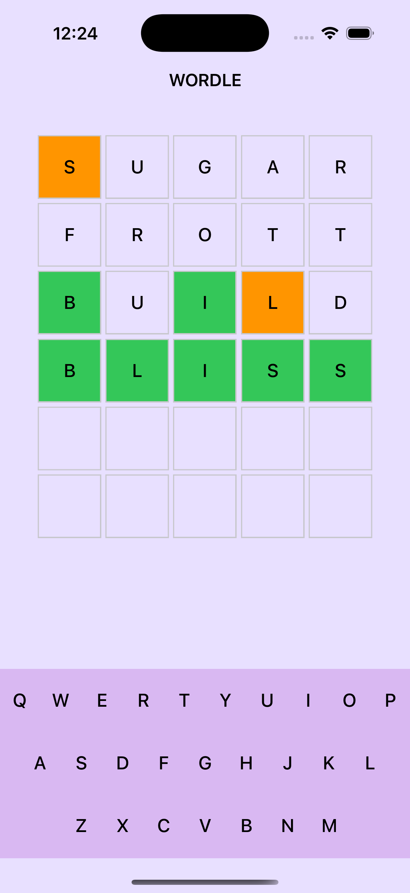

# WordleGame (iOS)

A fun popular Wordle game built using Swift and UIKit.

## 🎮 Features

- A 5-letter word guessing game
- On-screen keyboard UI with interactive feedback
- Colored boxes to indicate:
  - 🟩 Correct letter in correct position (Green)
  - 🟧 Correct letter in wrong position (Orange)
  - ⬜️ Empty or incorrect guesses
- Fun, colorful UI designed to be engaging and beginner-friendly

## Screenshots

  

## 🛠 Tech Stack

- **Language**: Swift
- **UI Framework**: UIKit
- **Architecture**: MVC

## 🔤 How It Works

- The app randomly selects a 5-letter word from a word list.
- Players use the on-screen keyboard to guess the word within 6 tries.
- Each guessed letter is displayed on the board with visual feedback

## 💡 Future Improvements

- Add dictionary validation for real-word guesses
- Allow daily puzzles

